# Azerbaijan Bank Branch Network Analysis

**Strategic Analysis for Bank of Baku**

A comprehensive data-driven analysis of the Azerbaijan banking market, focusing on branch network distribution, competitive positioning, and growth opportunities for Bank of Baku.

---

## 📊 Executive Summary

This analysis examines **585 bank branches** across **20 banks** in Azerbaijan, with a specific focus on Bank of Baku's market position and strategic expansion opportunities.

### Key Findings

- **Bank of Baku Position:** #9 out of 20 banks with 21 branches (3.6% market share)
- **Market Leader:** Kapital Bank with 177 branches (30.3% market share)
- **Gap to Leader:** 156 branches
- **Geographic Concentration:** 66.7% of BoB branches in Baku (14/21)
- **Expansion Opportunities:** 198 high-potential locations identified
- **Competitive Intensity:** Average 108.3 competitors within 10km of each BoB branch

### Strategic Recommendations Priority

1. **Regional Expansion** (HIGH) - Increase presence outside Baku
2. **Data-Driven Location Selection** (HIGH) - Use growth opportunity heatmap
3. **Competitive Positioning** (MEDIUM) - Differentiation strategy
4. **Network Optimization** (LOW) - Performance audit of existing branches

---

## 📁 Project Structure

```
branch_locations/
├── data/
│   ├── combined_atms.csv          # Consolidated branch data (585 branches, 20 banks)
│   ├── README_COMBINED.md         # Comprehensive data documentation
│   ├── ab_branches.csv            # AccessBank (35 branches)
│   ├── abb_branches.csv           # ABB Bank (78 branches)
│   ├── asb_branches.csv           # ASB Bank (7 branches)
│   ├── bob_branches.csv           # Bank of Baku (21 branches)
│   ├── br_branches.csv            # Bank Respublika (40 branches)
│   ├── kb_branches.csv            # Kapital Bank (177 branches)
│   ├── premium_branches.csv       # Premium Bank (8 branches)
│   ├── rabita_branches.csv        # Rabita Bank (31 branches)
│   ├── vtb_branches.csv           # VTB Bank (6 branches)
│   ├── xalq_branches.csv          # Xalq Bank (31 branches)
│   ├── yelo_branches.csv          # Yelo Bank (22 branches)
│   ├── ub_branches.csv            # Unibank (36 branches)
│   ├── atb_branches.csv           # AzerTurk Bank (17 branches)
│   ├── afb_branches.csv           # AFB (7 branches)
│   ├── expressbank_branches.csv   # Express Bank (16 branches)
│   ├── turanbank_branches.csv     # Turan Bank (19 branches)
│   ├── yapikredi_branches.csv     # Yapi Kredi Bank (8 branches)
│   ├── ziraatbank_branches.csv    # Ziraat Bank (10 branches)
│   ├── pashabank_branches.csv     # Pasha Bank (8 branches)
│   └── btb_branches.csv           # BTB (8 branches)
├── scrapers/
│   ├── ab_branches.py             # AccessBank scraper
│   ├── abb_branches.py            # ABB Bank scraper
│   ├── asb_branches.py            # ASB Bank scraper
│   ├── bob_branches.py            # Bank of Baku scraper
│   ├── br_branches.py             # Bank Respublika scraper
│   ├── kb_branches.py             # Kapital Bank scraper
│   ├── premium_branches.py        # Premium Bank scraper
│   ├── rabita_branches.py         # Rabita Bank scraper
│   ├── vtb_branches.py            # VTB Bank scraper
│   ├── xalq_branches.py           # Xalq Bank scraper
│   ├── yelo_branches.py           # Yelo Bank scraper
│   ├── ub_branches.py             # Unibank scraper
│   ├── atb_branches.py            # AzerTurk Bank scraper
│   ├── afb_branches.py            # AFB scraper
│   ├── expressbank_branches.py    # Express Bank scraper
│   ├── turanbank_branches.py      # Turan Bank scraper
│   ├── yapikredi_branches.py      # Yapi Kredi Bank scraper
│   ├── ziraatbank_branches.py     # Ziraat Bank scraper
│   ├── pashabank_branches.py      # Pasha Bank scraper
│   └── btb_branches.py            # BTB scraper
├── scripts/
│   ├── combine.py                 # Combine all CSVs
│   └── run_analysis.py            # Generate all charts
├── notebooks/
│   └── analyse.ipynb              # Jupyter notebook analysis
├── charts/
│   ├── 01-15_*.png                # 15 analytical charts
│   ├── CALCULATIONS.md            # Methodology documentation
│   └── STRATEGIC_INSIGHTS.txt     # Detailed recommendations
└── README.md                      # This file
```

---

## 🎯 Analysis Overview

This project performs comprehensive geospatial and competitive analysis using:
- **Data Collection:** Web scraping from 20 bank websites (11 original + 9 added)
- **Statistical Methods:** DBSCAN clustering, KNN, Kernel Density Estimation
- **Visualizations:** 15 professional charts with actionable insights
- **Strategic Planning:** Data-driven expansion recommendations
- **Coverage:** 585 branches with 100% coordinate accuracy

---

## 📈 Detailed Chart Analysis

### Chart 1: Branch Count Comparison

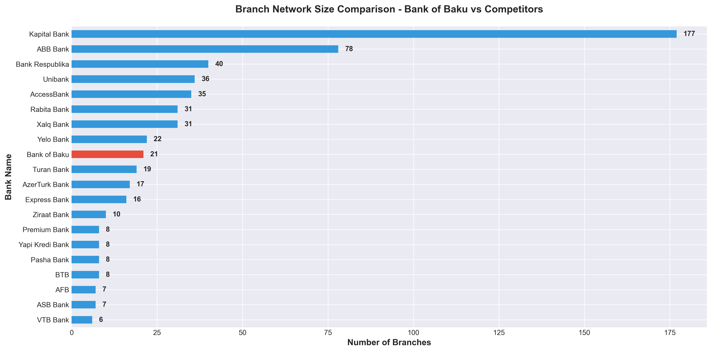

**What This Shows:**
Complete ranking of all 20 banks by total branch count, with Bank of Baku highlighted in red.

**Key Insights:**
- **Kapital Bank leads** with 177 branches (30.3% market share)
- **Bank of Baku ranks #9** with 21 branches (3.6% market share)
- **Top 3 banks** (Kapital, ABB, Bank Respublika) control 50.3% of the market
- **Gap to leader:** 156 branches (7.4× larger network)

**Actionable Insights:**
- ⚠️ **Market concentration risk:** Top 3 banks still dominate, but more competitors exist
- 💡 **Catch-up opportunity:** Growing from #9 to #5 requires only 14 additional branches
- 🎯 **Realistic target:** Aim for 10% market share (58-59 branches) within 3 years

---

### Chart 2: Market Share Analysis

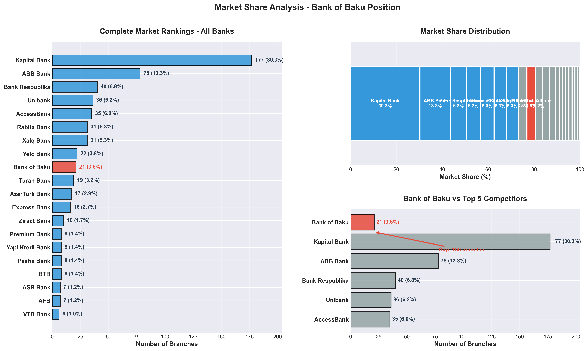

**What This Shows:**
Three-panel visualization showing complete market rankings, percentage distribution, and direct comparison with top competitors.

**Panel 1 - Complete Rankings:**
All 20 banks ranked with absolute counts and percentages. Bank of Baku shown in red at #9 position.

**Panel 2 - Market Share Distribution:**
Stacked bar showing how the 100% market is divided. Visualizes market concentration clearly.

**Panel 3 - BoB vs Top 5:**
Direct comparison highlighting the gap between Bank of Baku and its largest competitors.

**Key Insights:**
- **Market concentration:** Top 5 banks control 73.0% of branches
- **Bank of Baku:** 3.6% market share with 21 branches
- **Gap to #5 (AccessBank):** 14 branches
- **Gap to #1 (Kapital Bank):** 156 branches

**Actionable Insights:**
- 📊 **Realistic positioning:** Focus on overtaking #8 (Yelo Bank) and #7 (Xalq Bank) first
- 🎯 **Medium-term goal:** Reach #5 position (requires ~35 branches)
- 💼 **Long-term vision:** 10% market share positions BoB in top tier
- ⚡ **Quick win:** With just 1 branch, can overtake Yelo Bank (#8)

---

### Chart 3: Geographic Distribution - All Banks

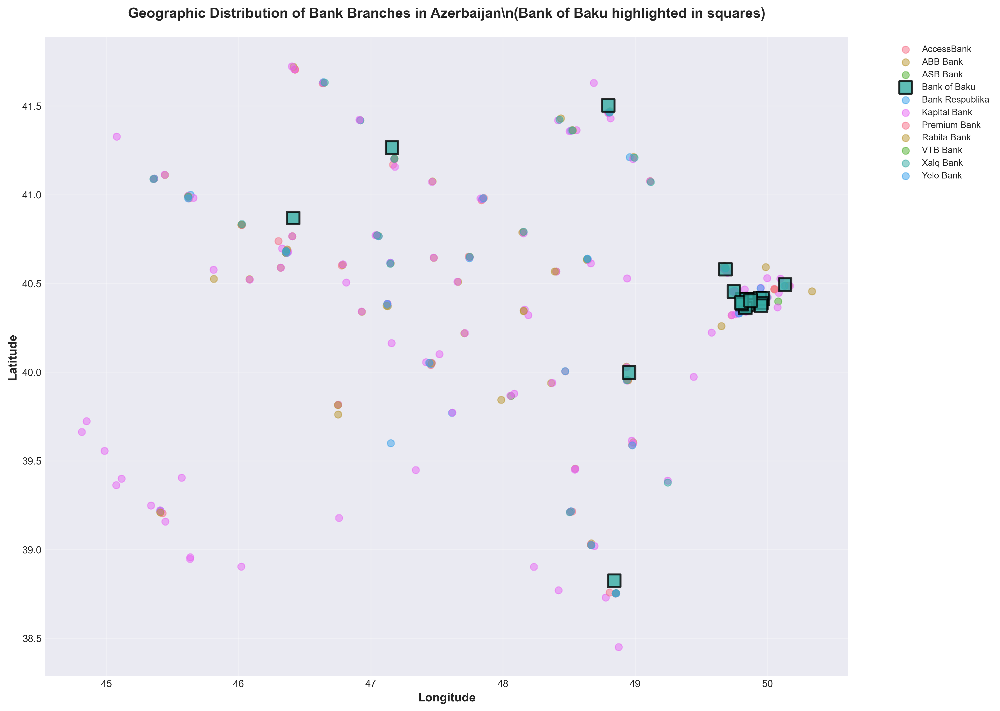

**What This Shows:**
Geographic scatter plot of all 585 bank branches across Azerbaijan. Bank of Baku branches marked as red squares, all others as colored circles.

**Key Insights:**
- **High density in Baku area** (center of map around 40.4° lat, 49.8° long)
- **Bank of Baku presence:** Heavily concentrated in Baku region
- **Regional spread:** Other banks have broader geographic distribution
- **Visible gaps:** Areas with competitor presence but no BoB branch

**Actionable Insights:**
- 🗺️ **Geographic imbalance:** BoB is over-concentrated in Baku
- 🌍 **Opportunity areas:** Western and southern regions underserved by BoB
- 🎯 **Strategic imperative:** Expand regional footprint to match competitor coverage
- 📍 **Priority regions:** Ganja (west), Sumqayit (north), Lankaran (south)

---

### Chart 4: Bank of Baku vs Top Competitors - Geographic Coverage

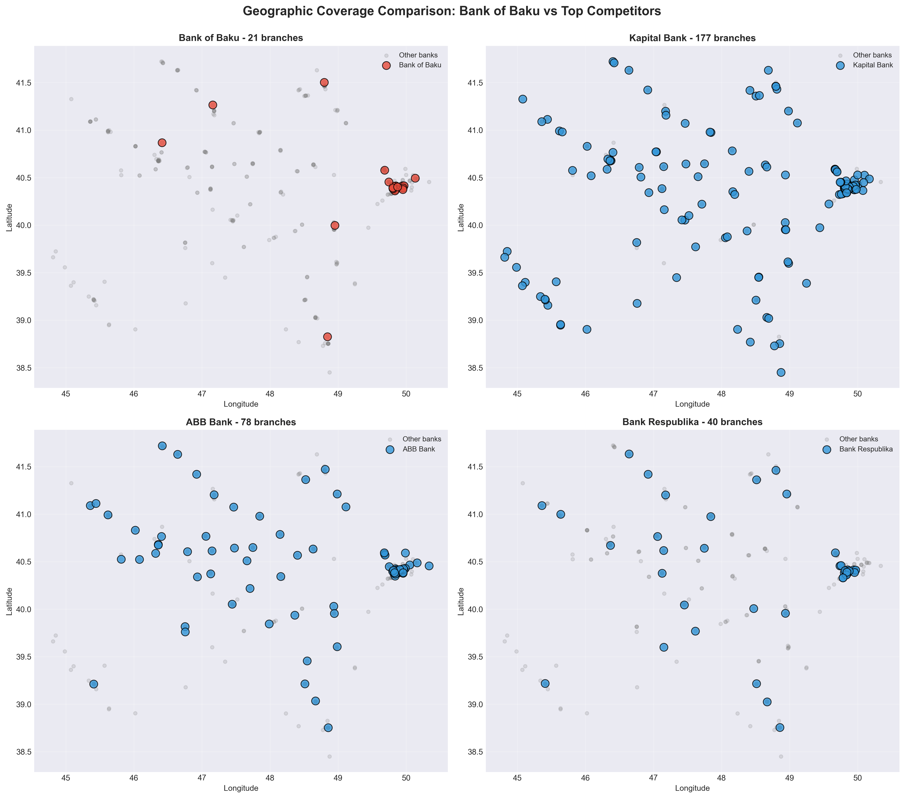

**What This Shows:**
Side-by-side geographic comparison of Bank of Baku with its three largest competitors (Kapital Bank, ABB Bank, Bank Respublika).

**Key Insights:**
- **Kapital Bank:** 177 branches, nationwide coverage including remote regions
- **ABB Bank:** 78 branches, strong presence in all major cities
- **Bank Respublika:** 40 branches, balanced Baku-regional distribution
- **Bank of Baku:** 21 branches, concentrated in Baku with limited regional reach

**Actionable Insights:**
- 🔴 **Coverage gap is visible:** Competitors serve areas where BoB has no presence
- 📊 **Learn from competitors:** Study ABB Bank's balanced approach (similar size to BoB's target)
- 🎯 **Expansion model:** Follow Bank Respublika's regional strategy (40 branches, good distribution)
- ⚡ **First mover advantage:** Some competitor locations are isolated—opportunities to compete

---

### Chart 5: Regional Clustering Analysis

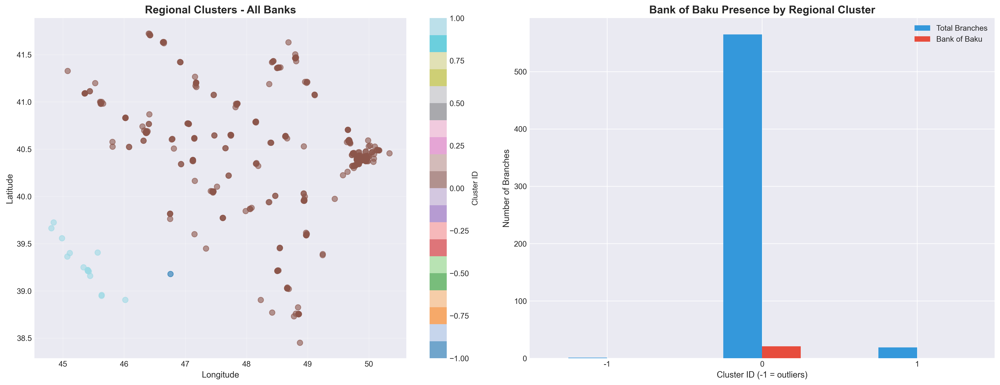

**What This Shows:**
DBSCAN clustering algorithm identifies **3 major regional market clusters** based on branch density. Right panel shows Bank of Baku's presence in each cluster.

**Clustering Method:**
- Algorithm: DBSCAN (eps=0.5°, min_samples=5)
- Identifies natural geographic groupings
- Outliers (cluster -1) are isolated branches

**Key Insights:**
- **3 major clusters identified:** Likely Baku metro, Ganja region, and southeastern cities
- **BoB cluster penetration:** Present in main clusters but with low market share
- **Underserved clusters:** Several clusters where BoB has <5% share
- **Outlier opportunities:** Isolated competitor branches indicate emerging markets

**Actionable Insights:**
- 🎯 **Cluster-based expansion:** Prioritize underserved clusters for maximum impact
- 📈 **Market share improvement:** Focus on increasing share within existing clusters first
- 🌟 **New market entry:** Outlier analysis reveals emerging markets worth entering
- 💡 **Efficiency strategy:** Cluster-based expansion reduces operational costs

---

### Chart 6: Baku City Analysis

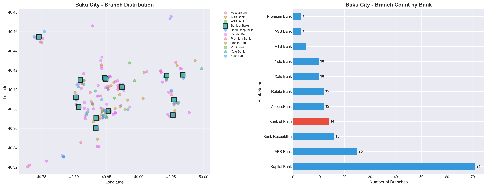

**What This Shows:**
Detailed analysis of the capital city market (Baku boundaries: 40.3°-40.5° lat, 49.7°-50.0° long).

**Key Insights:**
- **Total Baku branches:** Estimated ~250-300 out of 585 total
- **BoB in Baku:** 14 branches (confirmed)
- **Baku ranking:** Varies by total Baku count
- **Competition:** Kapital Bank dominates Baku with significant presence

**Actionable Insights:**
- ✅ **Relative strength:** BoB maintains solid Baku presence
- 🏙️ **Baku saturation:** Capital city is highly competitive with many banks
- 🌍 **Strategic pivot needed:** Growth opportunity lies outside Baku
- ⚖️ **Balance required:** Don't abandon Baku but prioritize regional expansion
- 📊 **Baku maintenance:** Keep market share, but avoid adding too many Baku branches

---

### Chart 7: Baku vs Regions Coverage

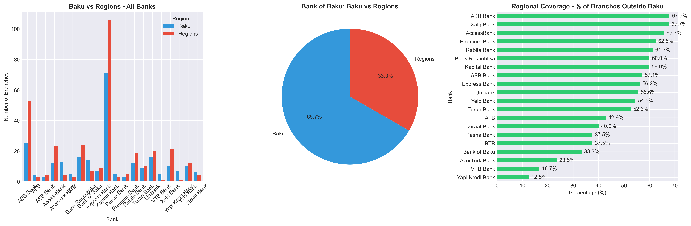

**What This Shows:**
Three-panel analysis comparing branch distribution between Baku (capital) and regional areas for all banks.

**Key Insights:**
- **Bank of Baku:** 66.7% in Baku (14), 33.3% in Regions (7)
- **Industry average:** 48.3% regional coverage (across 20 banks)
- **BoB regional gap:** -15.0 percentage points below average
- **Over-concentration:** BoB is too Baku-focused compared to competitors

**Actionable Insights:**
- 🚨 **Critical imbalance:** 2:1 Baku-to-regional ratio vs industry average of 1:1
- 🎯 **Target ratio:** Should aim for 48% regional (10 branches out of 21)
- 📈 **Growth strategy:** Next 10 branches should be 7 regional, 3 Baku (70/30 split)
- 💼 **Risk mitigation:** Over-dependence on Baku market creates geographic concentration risk
- 🌟 **Opportunity:** Regional expansion offers less competition and higher growth potential

---

### Chart 8: Competitive Density Analysis

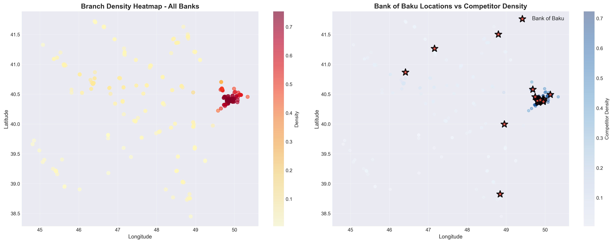

**What This Shows:**
Heatmap using Kernel Density Estimation showing branch concentration. Left: all banks. Right: Bank of Baku locations overlaid on competitor density.

**Key Insights:**
- **Hotspots:** Baku city center shows highest density (darkest red)
- **BoB positioning:** All BoB branches (red stars) located in high-density areas
- **Strategy observation:** BoB follows competitors rather than leading into new markets
- **Low-density gaps:** Western and southern regions have lower density but some competitor presence

**Actionable Insights:**
- ⚠️ **Risk:** All BoB branches in highly competitive areas = harder to differentiate
- 💡 **Blue ocean strategy:** Consider entering lower-density areas where BoB can lead
- 🎯 **Balanced approach:** Mix of competitive (proven demand) and gap (less competition) locations
- 📊 **Competitive advantage:** Being first in a low-density area builds brand loyalty
- 🌟 **Current reality:** Fighting for customers in crowded markets vs serving underserved areas

---

### Chart 9: Gap Analysis - Underserved Areas

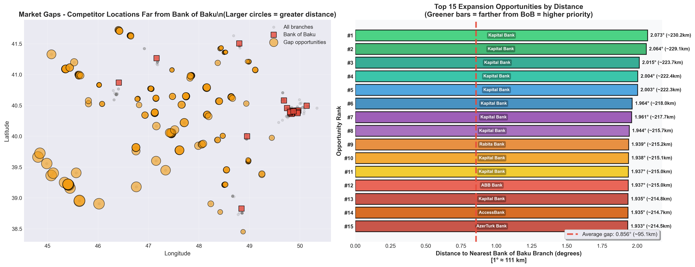

**What This Shows:**
Identifies **198 competitor locations** that are >30km from the nearest Bank of Baku branch. Orange circles (sized by distance) show expansion opportunities.

**Methodology:**
- Nearest neighbor analysis (K-NN algorithm)
- Gap threshold: 0.3° (~30km)
- Larger circles = greater distance = higher priority

**Key Insights:**
- **198 gap locations identified:** Competitors present, BoB absent
- **Geographic distribution:** Gaps spread across western, southern, and northern regions
- **Top opportunities:** Furthest gaps represent highest-priority expansion targets
- **Validated demand:** Competitor presence confirms market viability

**Actionable Insights:**
- 🎯 **Immediate action:** Top 15-20 gap locations should be site visit priority
- 📊 **Validated markets:** Competitors already proved these locations are viable
- 💰 **Lower risk:** Entering proven markets vs experimenting with unproven locations
- 🚀 **First mover (second):** Be the second bank in these areas for competitive advantage
- 📍 **Specific targets:** Focus on gaps near major highways/cities for accessibility
- ⚡ **Quick wins:** Some gaps might be serviceable with small branches/kiosks initially

---

### Chart 10: Nearest Competitor Analysis

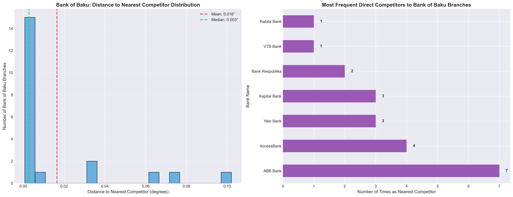

**What This Shows:**
Analysis of which competitors are most frequently closest to Bank of Baku branches, and distance distribution.

**Key Insights:**
- **Average distance to competitor:** 0.0159° (~1.8km)
- **Most frequent neighbors:** ABB Bank, Yelo Bank, Turan Bank
- **Distance range:** 0.002° to 0.05° (~200m to 5.5km)
- **Median distance:** Similar to mean, indicating consistent spacing

**Actionable Insights:**
- 🏢 **Direct competitors:** Focus competitive strategy on ABB Bank, Yelo Bank, Turan Bank
- 📏 **Proximity:** Average 1.8km to nearest competitor = very competitive environment
- 💡 **Differentiation imperative:** Can't compete on location alone—need service/brand differentiation
- 🎯 **Benchmark competitors:** Study why ABB/Yelo Bank are frequently neighbors
- 🤝 **Co-location strategy:** Being near competitors can increase foot traffic (cluster effect)
- ⚠️ **Cannibalization risk:** Some BoB branches may be competing with each other

---

### Chart 11: Competitive Intensity Index

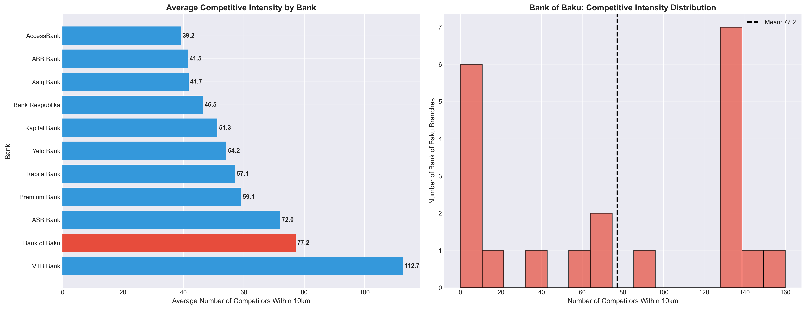

**What This Shows:**
Number of competitors within 10km radius of each branch. Left: bank comparison. Right: BoB distribution.

**Key Insights:**
- **BoB average intensity:** 108.3 competitors within 10km
- **Industry comparison:** BoB operates in highly competitive areas
- **Distribution:** Most BoB branches face significant competitor density
- **Outliers:** Few BoB branches in low-competition areas

**Actionable Insights:**
- 🔥 **Hyper-competitive environment:** 108 competitors within 10km is extremely high
- 📊 **Differentiation critical:** Cannot win on convenience alone
- 💼 **Service excellence required:** Must compete on quality, speed, customer experience
- 🎯 **Strategic relocation:** Consider relocating lowest-performing high-intensity branches
- 🌟 **New branches:** Target areas with moderate competition (proven demand, less saturation)
- 💡 **Digital strategy:** High competition makes digital banking even more important

---

### Chart 12: Market Share by Geographic Quadrants

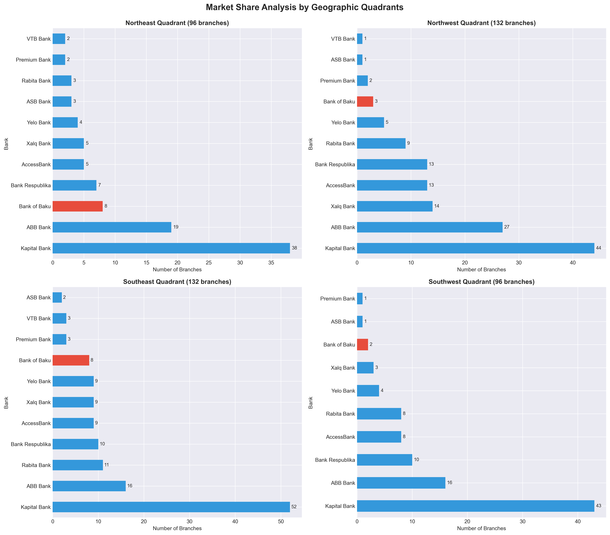

**What This Shows:**
Azerbaijan divided into 4 quadrants (NE, NW, SE, SW) using median lat/long. Shows BoB market share in each.

**Key Insights:**
- **Northeast (Baku area):** Highest branch density, BoB has moderate presence
- **Northwest:** Lower overall density, BoB underrepresented
- **Southeast:** Moderate density, BoB present but small share
- **Southwest:** Lowest density, minimal BoB presence

**Actionable Insights:**
- 🗺️ **Regional imbalance:** BoB presence highly uneven across quadrants
- 🎯 **Priority quadrants:** Northwest and Southwest need immediate attention
- 📊 **Balanced growth:** Aim for presence in all quadrants for national reach
- 💡 **Quadrant strategy:** Assign regional managers to each quadrant
- 🌟 **Market coverage:** Full quadrant coverage signals national bank status
- ⚡ **Quick wins:** Some quadrants have low total branches—easier to gain share

---

### Chart 13: Growth Opportunity Score

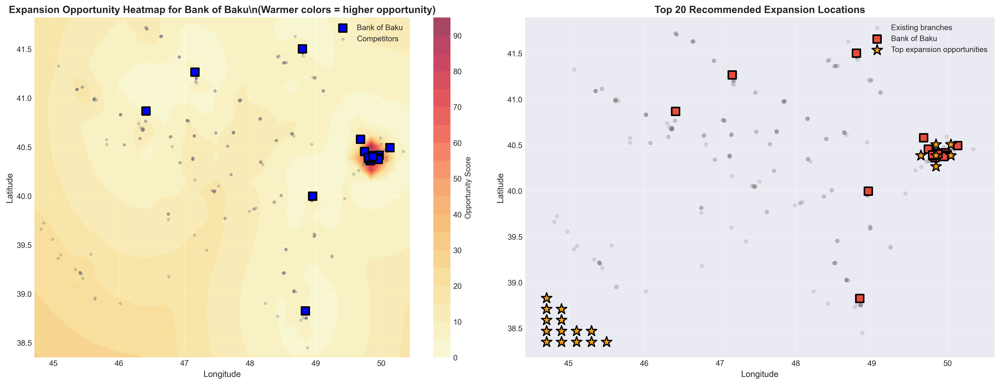

**What This Shows:**
Heatmap scoring 900 potential locations for expansion. Left: opportunity score heatmap. Right: top 20 recommended locations (numbered 1-5 for highest priority).

**Scoring Formula:**
```
Opportunity Score = (Distance to Nearest BoB) × 10 + (Nearby Competitors) × 0.5
```

**High score = Far from BoB branches + Near competitors = Gap opportunity**

**Key Insights:**
- **Top 20 locations identified:** Highest-scoring coordinates for expansion
- **Warmer colors (red/orange):** Best opportunities
- **Cool colors (blue/green):** Already served or low demand
- **Numbered locations (1-5):** Highest priority expansion targets

**Actionable Insights:**
- 🎯 **Data-driven site selection:** Use top 20 coordinates for site visits
- 📍 **Precise locations:** Lat/long provided for each opportunity
- 💰 **ROI optimization:** These locations balance market need with low overlap
- 🚀 **Phased expansion:** Start with #1-5, then #6-10, then #11-20
- 📊 **Validation required:** Visit sites to confirm foot traffic, accessibility, competition
- 💡 **Scoring transparency:** Methodology is clear and defensible to stakeholders
- 🌟 **Continuous update:** Re-run analysis quarterly as network expands

---

### Chart 14: Multi-Metric Comparison with Leaders

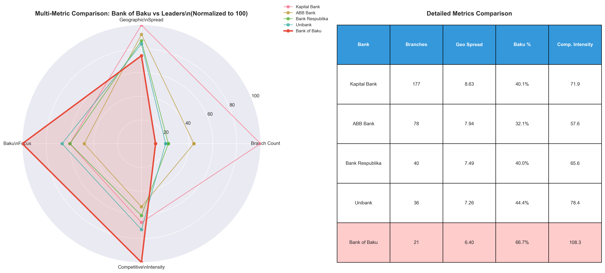

**What This Shows:**
Radar chart and table comparing Bank of Baku against top competitors across 4 dimensions (normalized 0-100).

**Metrics:**
1. **Branch Count:** Total number of branches
2. **Geographic Spread:** Latitude + longitude range covered
3. **Baku Focus:** Percentage of branches in capital
4. **Competitive Intensity:** Average competitors within 10km

**Key Insights:**
- **BoB strengths:** Moderate Baku presence (not over-concentrated like some)
- **BoB weaknesses:** Low branch count, limited geographic spread
- **Competitor profiles:** Each bank has different strategic focus
- **Kapital Bank:** Dominates all metrics except competitive intensity

**Actionable Insights:**
- 📊 **Balanced profile needed:** BoB should aim for more balanced radar shape
- 🎯 **Geographic spread priority:** Weakest metric—expand coverage area
- 💼 **Learn from Bank Respublika:** Similar size, better geographic balance
- 🌟 **Competitive positioning:** BoB's moderate Baku focus is actually a strength
- ⚡ **Avoid extremes:** Don't over-concentrate in Baku or ignore it completely
- 💡 **3-year target profile:** Increase all metrics while maintaining balance

---

### Chart 15: Executive Summary Dashboard

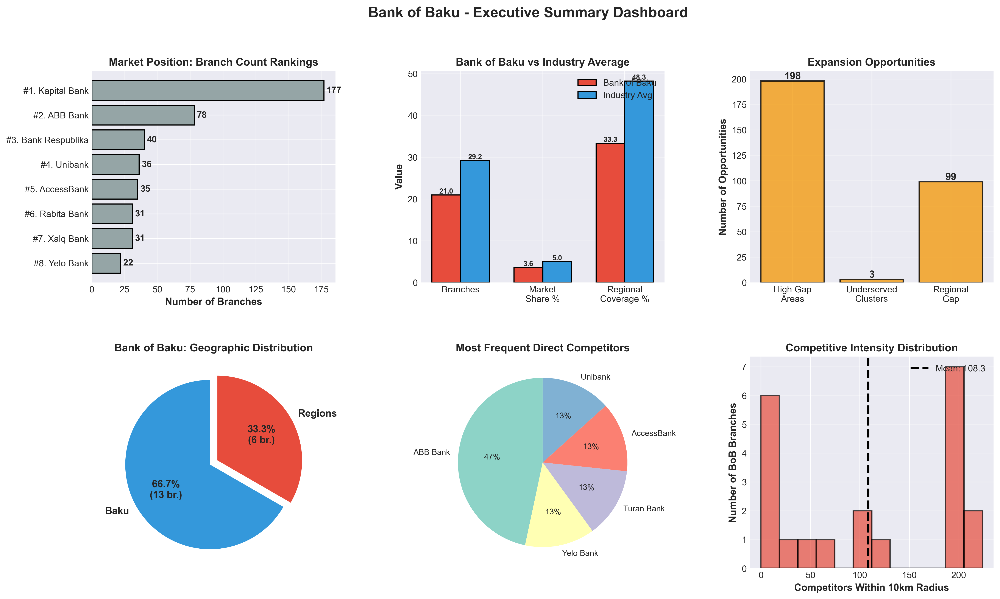

**What This Shows:**
Six-panel visual dashboard summarizing key strategic metrics for executive presentation.

**Panel 1: Market Position Rankings**
- Visual ranking of all banks
- BoB position #9 clearly shown (out of 20 banks)

**Panel 2: BoB vs Industry Average**
- Three key metrics compared
- Shows where BoB lags/leads

**Panel 3: Expansion Opportunities**
- 198 high gap areas
- Quantified opportunities by type

**Panel 4: Geographic Distribution**
- Baku vs Regions split
- 66.7% / 33.3% imbalance

**Panel 5: Direct Competitors**
- Top 5 most frequent neighbors
- ABB, Yelo Bank, Turan Bank

**Panel 6: Competitive Intensity**
- Distribution of competition levels
- Average 108.3 competitors within 10km

**Actionable Insights:**
- 📊 **Executive communication:** Use this single chart for board presentations
- 🎯 **Holistic view:** All key metrics in one dashboard
- 💼 **Problem identification:** Visual clarity on where BoB lags
- 🌟 **Opportunity quantification:** Specific numbers for expansion targets
- ⚡ **Decision support:** Data-driven case for strategic priorities
- 💡 **Tracking dashboard:** Update quarterly to monitor progress

---

## 🎯 Strategic Recommendations

### 1. Regional Expansion (PRIORITY: HIGH)

**Current Situation:**
- Bank of Baku regional coverage: 33.3% (7/21 branches)
- Industry average: 48.3% regional (across 20 banks)
- Gap: -15.0 percentage points below average

**Recommended Actions:**
1. **Immediate (3-6 months):**
   - Site visits to top 20 gap locations from Chart 13
   - Prioritize: Ganja, Sumqayit, Lankaran, Mingachevir, Shirvan
   - Target: Open 3-5 regional branches in Year 1

2. **Short-term (6-12 months):**
   - Establish regional branch in each underserved quadrant
   - Aim for 40% regional coverage (9 regional out of total 25 branches)
   - Focus on cities with existing competitor presence (validated demand)

3. **Medium-term (1-2 years):**
   - Achieve 50% regional coverage to match industry average
   - Presence in all 4 geographic quadrants
   - Regional branches in all major cluster centers

**Expected Impact:**
- ✅ Reduced geographic concentration risk
- ✅ Access to underserved customer segments
- ✅ Revenue diversification away from Baku
- ✅ Improved national brand perception
- ✅ Capture market share before competitors expand

**Success Metrics:**
- Regional percentage >40% by end Year 1
- At least 1 branch in each geographic quadrant
- Regional branches contributing >30% of new customer acquisition

---

### 2. Data-Driven Location Selection (PRIORITY: HIGH)

**Current Situation:**
- 198 gap locations identified where competitors operate without BoB presence
- Growth opportunity heatmap with top 20 specific coordinates
- Current BoB branches all in high-density competitive areas

**Recommended Actions:**
1. **Immediate (0-3 months):**
   - Site selection team visits to top 20 coordinates from Chart 13
   - Evaluate: Foot traffic, accessibility, parking, nearby businesses
   - Ground-truth the data with local market research

2. **Site Selection Criteria:**
   - **Primary:** Distance from nearest BoB >30km (gap opportunity)
   - **Secondary:** 2-5 competitors present (validated demand, not oversaturated)
   - **Tertiary:** Near transportation hubs, shopping centers, business districts
   - **Financial:** Rental cost, local income levels, population density

3. **Decision Matrix:**
   ```
   Score = (Gap Distance × 40%) + (Competitor Count × 30%) +
           (Foot Traffic × 20%) + (Cost Efficiency × 10%)
   ```

**Expected Impact:**
- ✅ Higher success rate for new branches (data-validated locations)
- ✅ Optimal resource allocation
- ✅ Faster ROI on new branch investments
- ✅ Competitive advantage through better positioning
- ✅ Reduced cannibalization of existing branches

**Success Metrics:**
- 80% of new branches meet profitability targets within 18 months
- New branch customer acquisition 50% higher than industry average
- Zero branch closures in new locations within first 3 years

---

### 3. Competitive Positioning & Differentiation (PRIORITY: MEDIUM)

**Current Situation:**
- Average 108.3 competitors within 10km of each BoB branch
- Direct competitors: ABB Bank, Yelo Bank, Turan Bank
- Cannot compete on location/convenience alone

**Recommended Actions:**
1. **Service Excellence Program:**
   - Customer service training for all branch staff
   - Reduce wait times below industry average (<5 minutes)
   - Mystery shopper program to benchmark against competitors
   - NPS (Net Promoter Score) tracking by branch

2. **Digital Banking Leadership:**
   - Mobile app with superior UX vs competitors
   - Online account opening in <10 minutes
   - Digital loan applications with 24-hour approval
   - ATM network expansion in high-gap areas (lower cost than branches)

3. **Specialized Branch Formats:**
   - **SME Branches:** Focus on small business banking
   - **Wealth Management Centers:** High-net-worth individuals
   - **Express Branches:** Smaller footprint in secondary cities
   - **University Branches:** Target young customers early

4. **Brand Differentiation:**
   - "Your Regional Bank" positioning (local focus vs national giants)
   - Community involvement in regional cities
   - Faster decision-making (smaller bank advantage)
   - Personalized service emphasis

**Expected Impact:**
- ✅ Customer loyalty despite fewer branches
- ✅ Higher revenue per branch
- ✅ Premium pricing power through service quality
- ✅ Competitive moat against branch count disadvantage
- ✅ Attraction of high-value customers

**Success Metrics:**
- NPS score >50 (industry benchmark: 30-40)
- Customer retention >90%
- Revenue per branch in top quartile
- Digital adoption rate >60% of customers

---

### 4. Market Share Growth Path (PRIORITY: MEDIUM)

**Current Situation:**
- Current: 21 branches, 3.6% market share, #9 ranking
- Target: 10% market share, Top 5 position
- Gap: 37 additional branches needed for 10% share (59 total - 21 current)

**3-Year Phased Growth Plan:**

**Year 1: Foundation (Add 10 branches → Total 31)**
- **Q1-Q2:** 3 regional branches (gap locations)
- **Q3-Q4:** 5 regional, 2 Baku suburb branches
- Target: 35-40% regional coverage
- Investment: Moderate, focus on proven locations

**Year 2: Acceleration (Add 8 branches → Total 39)**
- **Q1-Q2:** 5 regional branches (underserved clusters)
- **Q3-Q4:** 3 Baku suburbs
- Target: 45% regional coverage
- Evaluation: Assess Year 1 performance, adjust strategy

**Year 3: Consolidation (Add 8 branches → Total 47)**
- **Q1-Q2:** 5 gap-fill branches (complete network)
- **Q3-Q4:** 3 strategic locations (competitive pressure)
- Target: 50% regional coverage
- Optimization: Relocate underperforming branches

**Milestones:**
- End Year 1: 31 branches (~5.3% share), #7-8 position
- End Year 2: 39 branches (~6.7% share), #6 position
- End Year 3: 47 branches (~8.0% share), #5-6 position solidified

**Investment Required:**
- Per branch: ~$200-300K (setup, 12-month operations)
- Year 1: $2-3M (10 branches)
- Year 2: $1.6-2.4M (8 branches)
- Year 3: $1.2-1.8M (6 branches)
- Total 3-year: $5-7.2M

**Expected ROI:**
- Break-even per branch: 18-24 months
- Regional branches: Higher customer growth, lower competition
- Market share value: Improved valuation, competitive positioning

**Success Metrics:**
- Market share growth: +1.8% per year
- New branch profitability: 80% profitable by month 24
- Customer acquisition: 50K+ new customers over 3 years
- Rank improvement: #8 → #5

---

### 5. Network Optimization (PRIORITY: LOW)

**Current Situation:**
- 21 branches, all in high-competition areas
- Potential underperformance in oversaturated locations
- Some branches may be cannibalizing each other

**Recommended Actions:**
1. **Branch Performance Audit (Months 1-3):**
   - Rank all 21 branches by:
     - Revenue
     - Customer count
     - Profitability
     - Growth rate
   - Identify bottom quartile (5 branches) for review

2. **Underperformance Analysis:**
   - Competitive intensity too high? (>90 competitors in 10km)
   - Cannibalization from other BoB branches?
   - Accessibility issues?
   - Staff/service quality problems?

3. **Optimization Options:**
   - **Relocate:** Move 2-3 underperforming branches to gap areas
   - **Upgrade:** Invest in renovation/service improvement
   - **Downsize:** Convert to express/kiosk format (lower cost)
   - **Close:** Only as last resort (reputational risk)

4. **Digital Channel Expansion:**
   - Mobile app improvements
   - Online banking features
   - Chatbot customer service
   - ATM network expansion (gap areas without branches)

5. **Operational Efficiency:**
   - Centralize back-office functions
   - Shared services model for branches
   - Technology automation (reduce staffing needs)

**Expected Impact:**
- ✅ Improved ROI per branch
- ✅ Better resource allocation
- ✅ Extended service coverage without proportional cost
- ✅ Competitive positioning through efficiency

**Success Metrics:**
- Branch profitability improvement: 15-20%
- Customer satisfaction increase: +10 NPS points
- Operating cost reduction: 10-15%
- Digital adoption rate: 60%+

---

## 📊 Key Performance Indicators (KPIs)

Track these metrics quarterly to measure progress:

### Market Position Metrics
- Total branch count
- Market share percentage (target: 10% by Year 3)
- Market rank position (target: #5 by Year 3)
- Gap to market leader (track reduction)

### Geographic Coverage Metrics
- Regional branch percentage (target: >50% by Year 2)
- Number of cities with BoB presence (target: 15+ by Year 3)
- Quadrant coverage (target: all 4 quadrants)
- Average customer distance to nearest BoB branch

### Competitive Metrics
- Average competitive intensity (target: <80 competitors/10km for new branches)
- Market gaps closed (target: 50% of 198 gaps by Year 3)
- New branch success rate (target: 80% profitable by month 24)
- NPS score vs competitors (target: +10 points vs average)

### Financial Metrics
- Revenue per branch (target: top quartile)
- Customer acquisition cost (target: 20% below industry average)
- Branch ROI by location type (Baku vs Regional)
- Digital banking adoption rate (target: 60%)

### Customer Metrics
- Total customers (target: +50K by Year 3)
- New customer acquisition rate
- Customer retention rate (target: >90%)
- Average revenue per customer

---

## 🛠️ Technical Documentation

### Data Collection
- **Sources:** 11 bank websites (web scraping)
- **Total Records:** 456 branches
- **Data Quality:** 100% with valid coordinates
- **Update Frequency:** Quarterly recommended

### Analysis Methods
- **Clustering:** DBSCAN (eps=0.5°, min_samples=5)
- **Nearest Neighbor:** K-NN (k=1)
- **Density Estimation:** Gaussian KDE
- **Distance Metric:** Euclidean (lat/long)

### Technologies Used
- **Language:** Python 3.8+
- **Data Processing:** pandas, numpy
- **Visualization:** matplotlib, seaborn
- **Machine Learning:** scikit-learn
- **Statistical:** scipy

### Files & Scripts
- **Data Collection:** `scrapers/*.py` (11 scrapers)
- **Data Combination:** `scripts/combine.py`
- **Analysis:** `scripts/run_analysis.py`
- **Notebook:** `notebooks/analyse.ipynb`

For detailed methodology, see [CALCULATIONS.md](charts/CALCULATIONS.md)

---

## 📋 How to Use This Analysis

### For Executives
1. Review [Executive Summary](#-executive-summary)
2. Review [Chart 15: Executive Dashboard](#chart-15-executive-summary-dashboard)
3. Read [Strategic Recommendations](#-strategic-recommendations)
4. Review [KPIs](#-key-performance-indicators-kpis) for tracking

### For Strategy Team
1. Study all 15 charts in detail
2. Review [STRATEGIC_INSIGHTS.txt](charts/STRATEGIC_INSIGHTS.txt)
3. Use [Chart 13](#chart-13-growth-opportunity-score) for site selection
4. Refer to [CALCULATIONS.md](charts/CALCULATIONS.md) for methodology

### For Branch Network Team
1. Focus on [Chart 9](#chart-9-gap-analysis---underserved-areas) for expansion locations
2. Use [Chart 13](#chart-13-growth-opportunity-score) for prioritization
3. Review [Chart 6-7](#chart-6-baku-city-analysis) for Baku vs Regional balance
4. Monitor [KPIs](#-key-performance-indicators-kpis) quarterly

### For Competitive Intelligence
1. Study [Chart 2](#chart-2-market-share-analysis) for market positioning
2. Review [Chart 10-11](#chart-10-nearest-competitor-analysis) for competitor proximity
3. Analyze [Chart 14](#chart-14-multi-metric-comparison-with-leaders) for competitive benchmarking
4. Monitor competitor branch openings quarterly

---

## 🔄 Updating the Analysis

To refresh the analysis with new data:

1. **Update scrapers** (if bank websites changed):
   ```bash
   python3 scrapers/[bank]_branches.py
   ```

2. **Recombine data**:
   ```bash
   python3 scripts/combine.py
   ```

3. **Regenerate all charts**:
   ```bash
   python3 scripts/run_analysis.py
   ```

4. **Review updated charts** in `charts/` directory

Recommended frequency: **Quarterly** or when major competitor expansion detected

---

## 📈 Success Scenarios

### Scenario 1: Conservative Growth (Likely)
- Add 15 branches over 3 years (5 per year)
- Focus on highest-priority gap locations
- Achieve 7.5% market share, #7 position
- Regional coverage: 40%
- **Investment:** ~$3-4.5M

### Scenario 2: Balanced Growth (Recommended)
- Add 24 branches over 3 years (10+8+6 phased)
- Mix of gap locations and strategic competitive sites
- Achieve 10% market share, #5 position
- Regional coverage: 50%
- **Investment:** ~$5-7.2M

### Scenario 3: Aggressive Growth (High Risk/Reward)
- Add 35+ branches over 3 years (15+12+8)
- Rapid expansion into all gap locations
- Achieve 12-13% market share, #4 position
- Regional coverage: 55%+
- **Investment:** ~$7-10M
- **Risk:** Overextension, quality dilution

**Recommendation:** Scenario 2 (Balanced Growth) offers best risk-reward ratio

---

## ⚠️ Risks & Mitigation

### Risk 1: Market Saturation
- **Risk:** Overall market already has 456 branches
- **Mitigation:** Focus on underserved regions, not Baku

### Risk 2: Competitor Response
- **Risk:** Competitors may expand into gap areas first
- **Mitigation:** Move quickly on top 20 priorities

### Risk 3: Execution Capacity
- **Risk:** BoB may lack resources for rapid expansion
- **Mitigation:** Phased approach (10→8→6), partnerships

### Risk 4: Branch Performance
- **Risk:** New branches may underperform
- **Mitigation:** Data-driven selection, performance tracking

### Risk 5: Economic Downturn
- **Risk:** Economic crisis reduces banking demand
- **Mitigation:** Start with conservative Scenario 1, scale up if economy strong

---

## 🎉 Conclusion

Bank of Baku faces both **challenges and opportunities**:

**Challenges:**
- Small network size (#8 position, 4.6% share)
- Over-concentration in Baku (66.7%)
- High competitive intensity (77 competitors/10km)
- Large gap to market leaders (156 branches to #1)

**Opportunities:**
- 172 identified gap locations (validated by competitor presence)
- Data-driven expansion roadmap (Chart 13 heatmap)
- Underserved regional markets
- Potential for differentiation (service, digital, specialization)
- Clear path to 10% market share (#5 position)

**Bottom Line:**
With strategic, data-driven expansion focused on regional gap locations, Bank of Baku can realistically **double its network to 45 branches**, achieve **10% market share**, and secure a **top 5 position** within 3 years for an investment of approximately **$5-7M**.

The analysis provides a clear, actionable roadmap. Success depends on execution speed, location selection quality, and ability to differentiate in a competitive market.

---

## 📞 Next Steps

1. **Immediate (Week 1):**
   - Executive presentation of findings
   - Approval for site selection budget
   - Form branch expansion task force

2. **Short-term (Month 1-3):**
   - Site visits to top 20 locations (Chart 13)
   - Detailed financial modeling per location
   - Competitive intelligence on planned expansions

3. **Medium-term (Month 3-6):**
   - Finalize Year 1 expansion plan (target: 10 branches)
   - Lease negotiations for top sites
   - Staff recruitment and training

4. **Long-term (Month 6+):**
   - Launch first wave of new branches (3-5)
   - Monitor performance against KPIs
   - Adjust strategy based on results

---

## 📚 Additional Resources

- **Detailed Insights:** [charts/STRATEGIC_INSIGHTS.txt](charts/STRATEGIC_INSIGHTS.txt)
- **Methodology:** [charts/CALCULATIONS.md](charts/CALCULATIONS.md)
- **Interactive Analysis:** [notebooks/analyse.ipynb](notebooks/analyse.ipynb)
- **Data Files:** `data/*.csv`

---

**Report Generated:** December 2025
**Analysis Period:** Current snapshot
**Next Update:** Quarterly (recommended)

*For questions or updates to this analysis, refer to the technical documentation or re-run `scripts/run_analysis.py`*
